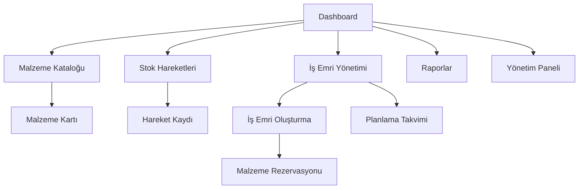

# Mermer Makinesi Stok & Planlama Sistemi - Ürün Gereksinim Dokümanı

## 1. Ürün Genel Bakış
Mermer makineleri (silim, tırmık, yarma, ebatlama vb.) üreten fabrikalar için elektrik/pano malzemelerinin takibi, makine BOM yönetimi, iş emri planlama ve otomatik stok düşümü yapan web tabanlı entegre sistem.
- Elektrik/pano malzemeleri için tam izlenebilirlik sağlar: kim aldı, ne zaman, nereye kullanıldı.
- İleride tüm fabrika envanterini kapsayacak şekilde ölçeklenebilir API-first mimari ile tasarlanmıştır.

## 2. Temel Özellikler

### 2.1 Kullanıcı Rolleri
| Rol | Kayıt Yöntemi | Temel Yetkiler |
|-----|---------------|----------------|
| Admin | Sistem yöneticisi tarafından oluşturma | Tüm sistem ayarları, kullanıcı yönetimi, tam erişim |
| Depo | Admin tarafından davet | Stok giriş/çıkış, malzeme hareketleri, envanter sayımı |
| Teknisyen | Admin/Planlama tarafından davet | İş emri malzeme kullanımı, BOM görüntüleme |
| Planlama | Admin tarafından davet | İş emri oluşturma, makine planlama, BOM yönetimi |
| Satınalma | Admin tarafından davet | Tedarikçi yönetimi, satın alma emirleri, stok giriş |

### 2.2 Özellik Modülleri
Sistemimiz aşağıdaki ana sayfalardan oluşmaktadır:
1. **Dashboard**: kritik stok uyarıları, son hareketler özeti, iş emri durumları, eksik malzeme listesi
2. **Malzeme Kataloğu**: malzeme listesi, kategori filtreleme, stok seviyeleri, tedarikçi bilgileri
3. **Stok Hareketleri**: giriş/çıkış kayıtları, hareket geçmişi, belge ekleri, audit izleme
4. **Makine & BOM Yönetimi**: makine tanımları, BOM editörü, versiyon kontrolü, döküman ekleme
5. **İş Emri Yönetimi**: sipariş oluşturma, planlama takvimi, durum takibi, malzeme rezervasyonu
6. **Raporlar**: stok raporları, hareket analizi, maliyet hesaplama, performans metrikleri
7. **Yönetim Paneli**: kullanıcı yönetimi, sistem ayarları, yetki tanımları, audit logları

### 2.3 Sayfa Detayları
| Sayfa Adı | Modül Adı | Özellik Açıklaması |
|-----------|-----------|--------------------|
| Dashboard | Kritik Stok Uyarıları | Min stok seviyesinin altındaki malzemeleri listele, renk kodlu uyarılar göster |
| Dashboard | Son Hareketler | Son 24 saatteki stok giriş/çıkışlarını özet halinde göster |
| Dashboard | İş Emri Durumları | Aktif iş emirlerinin durumlarını (Yeni, Planlandı, Üretimde, Tamamlandı) göster |
| Malzeme Kataloğu | Malzeme Listesi | Tüm malzemeleri kategori, tedarikçi, stok durumuna göre filtreleme ve arama |
| Malzeme Kataloğu | Malzeme Kartı | Detaylı malzeme bilgileri, stok geçmişi, tedarikçi bilgileri, fotoğraf ekleme |
| Stok Hareketleri | Hareket Kaydı | Giriş/çıkış/iade hareketlerini kaydet, kullanıcı, tarih, miktar, açıklama, belge ekleme |
| Stok Hareketleri | Hareket Geçmişi | Tüm hareketleri filtreleme, arama, Excel export, audit trail görüntüleme |
| Makine & BOM | Makine Tanımları | Makine modeli, versiyon, açıklama, teknik döküman (DWG/PDF) ekleme |
| Makine & BOM | BOM Editörü | Makine için gerekli malzeme listesi, miktar, birim tanımlama ve düzenleme |
| İş Emri Yönetimi | İş Emri Oluşturma | Müşteri/dahili sipariş, makine seçimi, miktar, planlanan tarihler |
| İş Emri Yönetimi | Malzeme Rezervasyonu | BOM'a göre otomatik stok düşümü, eksik malzeme kontrolü, backorder oluşturma |
| İş Emri Yönetimi | Planlama Takvimi | Gantt chart görünümü, kaynak planlama, tarih çakışma kontrolü |
| Raporlar | Stok Raporları | Mevcut stok durumu, hareket analizi, ABC analizi, dönemsel karşılaştırma |
| Raporlar | Maliyet Analizi | İş emri bazlı malzeme maliyeti, karlılık analizi, bütçe takibi |
| Yönetim Paneli | Kullanıcı Yönetimi | Kullanıcı ekleme/düzenleme, rol atama, yetki tanımlama, aktiflik durumu |
| Yönetim Paneli | Sistem Ayarları | Genel sistem parametreleri, e-posta ayarları, yedekleme konfigürasyonu |

## 3. Temel Süreçler

**Satınalma Süreci:**
Satınalma personeli fatura ile malzeme girişi yapar → sistem stok miktarını artırır → hareket kaydı oluşturur → audit log kaydeder.

**İş Emri Süreci:**
Planlama iş emri oluşturur (makine modeli + adet + tarih) → sistem BOM'u kontrol eder → malzeme uygunluğunu doğrular → teknisyen "Malzemeleri Kullan" butonuna basar → sistem BOM'a göre stoktan düşer → eksik varsa backorder oluşturur.

**Stok Kontrol Süreci:**
Sistem sürekli stok seviyelerini izler → min seviye altına düşen malzemeler için uyarı oluşturur → otomatik satın alma önerisi hazırlar → dashboard'da kritik stok uyarısı gösterir.

## 4. Kullanıcı Arayüzü Tasarımı

### 4.1 Tasarım Stili
- **Ana Renkler:** Mavi (#2563EB), Beyaz (#FFFFFF), Gri (#6B7280)
- **İkincil Renkler:** Yeşil (#10B981) başarı, Kırmızı (#EF4444) uyarı, Turuncu (#F59E0B) dikkat
- **Buton Stili:** Yuvarlatılmış köşeler (8px), gölge efekti, hover animasyonları
- **Font:** Inter, 14px varsayılan, 16px başlıklar, 12px küçük metinler
- **Layout:** Kart tabanlı tasarım, sol navigasyon menüsü, responsive grid sistemi
- **İkonlar:** Feather Icons seti, 20px boyut, tutarlı stil

### 4.2 Sayfa Tasarım Genel Bakış

| Sayfa Adı | Modül Adı | UI Elementleri |
|-----------|-----------|----------------|
| Dashboard | Kritik Stok Kartları | Kırmızı kenarlı uyarı kartları, stok seviyesi progress bar, hızlı aksiyon butonları |
| Dashboard | İstatistik Kartları | Büyük sayılar, trend okları, renk kodlu metrikler, son 7 gün karşılaştırması |
| Malzeme Kataloğu | Malzeme Tablosu | Sayfalama, sıralama, filtreleme, arama kutusu, toplu işlem seçenekleri |
| Malzeme Kataloğu | Malzeme Kartı | Fotoğraf alanı, detay formları, tab yapısı, hareket geçmişi tablosu |
| Stok Hareketleri | Hareket Formu | Modal popup, dropdown seçimler, tarih seçici, dosya yükleme alanı |
| İş Emri Yönetimi | Gantt Chart | Zaman çizelgesi, sürükle-bırak, renk kodlu durumlar, zoom kontrolleri |
| İş Emri Yönetimi | BOM Tablosu | Genişletilebilir satırlar, miktar girişi, stok durumu göstergesi |
| Raporlar | Grafik Alanları | Chart.js entegrasyonu, interaktif grafikler, export butonları |

### 4.3 Responsive Tasarım
Masaüstü öncelikli tasarım ile mobil uyumlu responsive yapı. Tablet ve mobil cihazlarda touch optimizasyonu, büyük butonlar ve kolay navigasyon sağlanır.