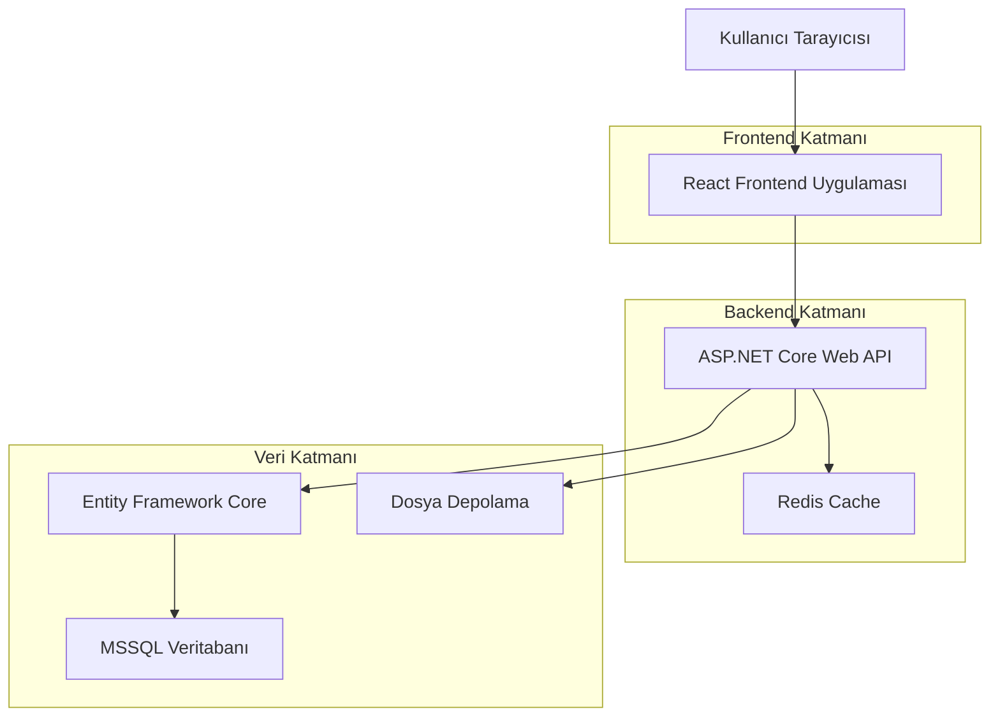
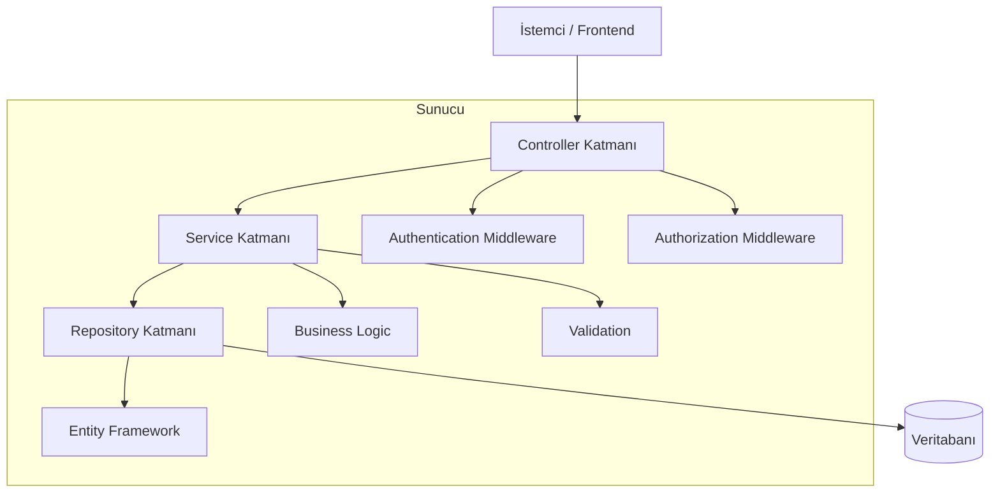
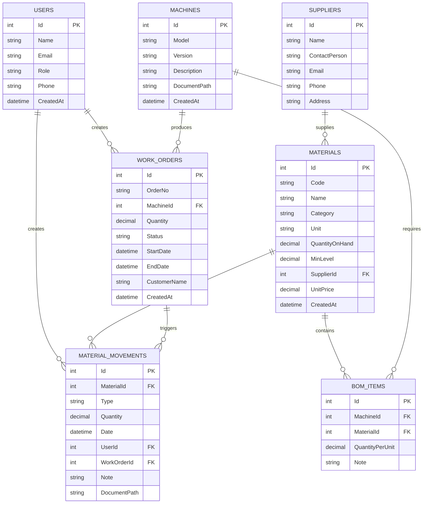

# Mermer Makinesi Stok & Planlama Sistemi - Teknik Mimari Dokümanı

## 1. Mimari Tasarım



## 2. Teknoloji Açıklaması

* **Frontend:** React\@18 + TypeScript + Tailwind CSS + Vite

* **Backend:** ASP.NET Core\@8 + Entity Framework Core + AutoMapper

* **Veritabanı:** Microsoft SQL Server 2022

* **Cache:** Redis\@7

* **Dosya Depolama:** Local File System (ileride Azure Blob Storage)

* **Authentication:** JWT Bearer Token + ASP.NET Core Identity

## 3. Route Tanımları

| Route             | Amaç                                                 |
| ----------------- | ---------------------------------------------------- |
| /                 | Ana dashboard sayfası, kritik stoklar ve genel durum |
| /login            | Kullanıcı giriş sayfası, JWT token alımı             |
| /materials        | Malzeme kataloğu listesi, arama ve filtreleme        |
| /materials/:id    | Malzeme detay sayfası, stok geçmişi ve düzenleme     |
| /movements        | Stok hareketleri listesi ve yeni hareket ekleme      |
| /machines         | Makine tanımları ve BOM yönetimi                     |
| /machines/:id/bom | Makine BOM detay ve düzenleme sayfası                |
| /workorders       | İş emri listesi ve yeni iş emri oluşturma            |
| /workorders/:id   | İş emri detayı, malzeme rezervasyonu ve durum takibi |
| /planning         | Planlama takvimi, Gantt chart görünümü               |
| /reports          | Raporlar ana sayfası, stok ve maliyet analizleri     |
| /admin            | Yönetim paneli, kullanıcı ve sistem ayarları         |

## 4. API Tanımları

### 4.1 Temel API

**Kimlik Doğrulama**

```
POST /api/auth/login
```

İstek:

| Parametre Adı | Parametre Tipi | Zorunlu | Açıklama                 |
| ------------- | -------------- | ------- | ------------------------ |
| email         | string         | true    | Kullanıcı e-posta adresi |
| password      | string         | true    | Kullanıcı şifresi        |

Yanıt:

| Parametre Adı | Parametre Tipi | Açıklama            |
| ------------- | -------------- | ------------------- |
| token         | string         | JWT access token    |
| refreshToken  | string         | Yenileme token'ı    |
| user          | UserDto        | Kullanıcı bilgileri |

Örnek:

```json
{
  "email": "admin@example.com",
  "password": "SecurePass123!"
}
```

**Malzeme Yönetimi**

```
GET /api/materials
POST /api/materials
GET /api/materials/{id}
PUT /api/materials/{id}
DELETE /api/materials/{id}
```

**Stok Hareketleri**

```
POST /api/materials/{id}/movements
```

İstek:

| Parametre Adı | Parametre Tipi | Zorunlu | Açıklama                            |
| ------------- | -------------- | ------- | ----------------------------------- |
| type          | string         | true    | Hareket tipi: "in", "out", "return" |
| quantity      | decimal        | true    | Hareket miktarı                     |
| workOrderId   | int            | false   | İlgili iş emri ID'si                |
| note          | string         | false   | Hareket açıklaması                  |

**İş Emri Yönetimi**

```
POST /api/workorders
POST /api/workorders/{id}/apply-bom
PUT /api/workorders/{id}/status
```

**BOM İşlemleri**

```
GET /api/machines/{id}/bom
POST /api/machines/{id}/bom
PUT /api/machines/{id}/bom/{bomId}
```

## 5. Sunucu Mimarisi Diyagramı



## 6. Veri Modeli

### 6.1 Veri Modeli Tanımı



### 6.2 Veri Tanımlama Dili

**Kullanıcılar Tablosu (Users)**

```sql
-- Tablo oluşturma
CREATE TABLE Users (
    Id INT IDENTITY(1,1) PRIMARY KEY,
    Name NVARCHAR(100) NOT NULL,
    Email NVARCHAR(255) UNIQUE NOT NULL,
    PasswordHash NVARCHAR(255) NOT NULL,
    Role NVARCHAR(50) NOT NULL CHECK (Role IN ('Admin', 'Depo', 'Teknisyen', 'Planlama', 'Satınalma')),
    Phone NVARCHAR(20),
    IsActive BIT DEFAULT 1,
    CreatedAt DATETIME2 DEFAULT GETDATE(),
    UpdatedAt DATETIME2 DEFAULT GETDATE()
);

-- İndeks oluşturma
CREATE INDEX IX_Users_Email ON Users(Email);
CREATE INDEX IX_Users_Role ON Users(Role);
```

**Malzemeler Tablosu (Materials)**

```sql
-- Tablo oluşturma
CREATE TABLE Materials (
    Id INT IDENTITY(1,1) PRIMARY KEY,
    Code NVARCHAR(50) UNIQUE NOT NULL,
    Name NVARCHAR(200) NOT NULL,
    Category NVARCHAR(50) NOT NULL CHECK (Category IN ('Elektrik', 'Pano', 'Mekanik', 'Diğer')),
    Unit NVARCHAR(20) NOT NULL CHECK (Unit IN ('Adet', 'Metre', 'Kilogram', 'Litre')),
    QuantityOnHand DECIMAL(18,3) DEFAULT 0,
    MinLevel DECIMAL(18,3) DEFAULT 0,
    UnitPrice DECIMAL(18,2) DEFAULT 0,
    SupplierId INT,
    PackageSize DECIMAL(18,3),
    ImagePath NVARCHAR(500),
    CreatedAt DATETIME2 DEFAULT GETDATE(),
    UpdatedAt DATETIME2 DEFAULT GETDATE(),
    FOREIGN KEY (SupplierId) REFERENCES Suppliers(Id)
);

-- İndeks oluşturma
CREATE INDEX IX_Materials_Code ON Materials(Code);
CREATE INDEX IX_Materials_Category ON Materials(Category);
CREATE INDEX IX_Materials_QuantityOnHand ON Materials(QuantityOnHand);
```

**Stok Hareketleri Tablosu (MaterialMovements)**

```sql
-- Tablo oluşturma
CREATE TABLE MaterialMovements (
    Id INT IDENTITY(1,1) PRIMARY KEY,
    MaterialId INT NOT NULL,
    Type NVARCHAR(20) NOT NULL CHECK (Type IN ('In', 'Out', 'Return', 'Adjustment')),
    Quantity DECIMAL(18,3) NOT NULL,
    Date DATETIME2 DEFAULT GETDATE(),
    UserId INT NOT NULL,
    WorkOrderId INT NULL,
    Note NVARCHAR(500),
    DocumentPath NVARCHAR(500),
    CreatedAt DATETIME2 DEFAULT GETDATE(),
    FOREIGN KEY (MaterialId) REFERENCES Materials(Id),
    FOREIGN KEY (UserId) REFERENCES Users(Id),
    FOREIGN KEY (WorkOrderId) REFERENCES WorkOrders(Id)
);

-- İndeks oluşturma
CREATE INDEX IX_MaterialMovements_MaterialId ON MaterialMovements(MaterialId);
CREATE INDEX IX_MaterialMovements_Date ON MaterialMovements(Date DESC);
CREATE INDEX IX_MaterialMovements_UserId ON MaterialMovements(UserId);
```

**Başlangıç Verileri**

```sql
-- Varsayılan admin kullanıcısı
INSERT INTO Users (Name, Email, PasswordHash, Role, Phone)
VALUES ('Sistem Yöneticisi', 'admin@mermermakinesi.com', 'hashed_password_here', 'Admin', '+90 555 123 4567');

-- Örnek malzeme kategorileri
INSERT INTO Materials (Code, Name, Category, Unit, QuantityOnHand, MinLevel, UnitPrice)
VALUES 
('ELK001', 'Sigorta 16A', 'Elektrik', 'Adet', 100, 20, 5.50),
('ELK002', 'Kontaktör 25A', 'Elektrik', 'Adet', 50, 10, 45.00),
('PAN001', 'Pano Kapısı 400x600', 'Pano', 'Adet', 25, 5, 120.00),
('MEK001', 'Vida M8x20', 'Mekanik', 'Adet', 500, 100, 0.25);
```

